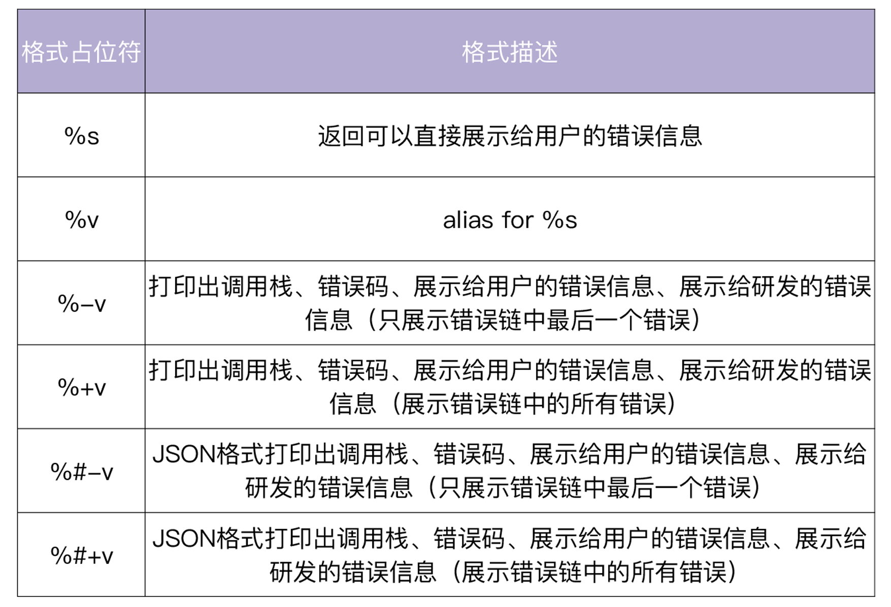

# simpleTikTok 错误码规范

## 概览
错误码包存放在项目根目录下的`pkg/error`中，实现了 [errors](https://github.com/marmotedu/errors) 包中的`ErrCode`接口

## 注册错误码
使用前需要在`pkg/error/code.go`文件中定义好错误码，（以`Err`开头）

在`pkg/error/register.go`文件中使用`register`函数将上一步定义好的错误注册到 [errors](https://github.com/marmotedu/errors) 包维护的map中

## 记录错误
1. 调用 [errors](https://github.com/marmotedu/errors) 包中的`WithCode`函数可以新建一个符合`ErrCode`接口的错误，该错误中包含了详细的错误堆栈，包括错误发生的函数、文件名、行号和错误信息
2. `Wrap`函数可以基于原有的错误进行包装，提供更详细的信息

总之，通过`WithCode`函数来创建新的 `withCode` 类型的错误；通过`WrapC`来将一个 `error` 封装成一个 `withCode` 类型的错误
```go
package main

import (
	"fmt"
	"github.com/marmotedu/errors"
)

func main() {
	fmt.Println(funcA())
}

func funcA() error {
	if err := funcB(); err != nil {
		return errors.Wrap(err, "funcA failed")
	}
	return nil
}

func funcB() error {
	// 这里的ErrDatabase需要提前在const.go中定义好并在register.go中注册
	// 否则会找不到错误信息
    return errors.WithCode(code.ErrDatabase, "funcB called failed!")
}
```
## 格式化错误
`withCode` 错误实现了一个`func (w *withCode) Format(state fmt.State, verb rune)`方法，该方法用来打印不同格式的错误信息，见下表：
